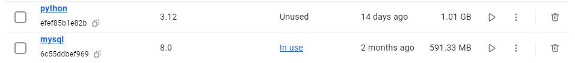

这是BS体系软件设计项目商品比价网站的仓库，其中包含了docker以及前后端的相关代码。

## Project setup
1. 首先克隆仓库到本地
```git
git clone https://github.com/sqc-cyh/B-S_PriceCompare_cyh/.git
```

2. 在根目录下运行`docker-compose up`进行部署

3. 打开本地浏览器并通过localhost访问8080端口即可访问网站内容

## Bug solve
以下是一些可能出现的运行bug：

* 镜像拉取失败：
    1. mysql:8.0
    2. python:3.12
    前往docker官网拉取镜像即可
    

* 爬虫时edgedriver相关报错：
    在backend的`Dockerfile`中解除以下注释，获取linux版本的edgedriver并配置到docker的`/usr/local/bin/`路径中：
    ```dockerfile
    # RUN apt-get update && apt-get install -y libgl1 unzip
    # RUN wget https://msedgedriver.azureedge.net/132.0.2957.48/edgedriver_linux64.zip\
    #     && unzip edgedriver_linux64.zip -d /usr/local/bin/ \
    #     && chmod +x /usr/local/bin/msedgedriver \
    #     && echo "Download successful"
    ```
    如果仍存在报错，请检查浏览器版本是否与edgedriver驱动版本一致。